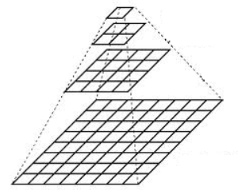

# SNL
想要写一个用于导航领域的C++标准库，~~不清楚要不要使用模板~~

## ***.gitignore***

```
# 忽略所有的 .a 文件
*.a
# 但跟踪所有的 lib.a，即便你在前面忽略了 .a 文件
!lib.a
# 只忽略当前目录下的 TODO 文件，而不忽略 subdir/TODO
/TODO
# 忽略任何目录下名为 build 的文件夹
build/
# 忽略 doc/notes.txt，但不忽略 doc/server/arch.txt
doc/*.txt
# 忽略 doc/ 目录及其所有子目录下的 .pdf 文件
doc/**/*.pdf
```

## *git*

```powershell
#git提交代码

git init #可能不需要
git add #文件/文件夹名
git commit -m '提交描述'
git push 

#删除某一文件 参考：https://www.jianshu.com/p/b4f93946a27d
git rm '+ 要删除的文件名'
git rm -r '+ 要删除的文件夹'
```


## _git_error_

```powershell
Updates were rejected because the remote contains work that you do  not have locally. This is usually caused by another repository pushing to the same ref. You may want to first integrate the remote changes  (e.g., 'git pull ...') before pushing again.
hint: See the 'Note about fast-forwards' in 'git push --help' for details.
#原因在于：远程仓库存在本地仓库不存在的提交
git pull
```


## _markdown_

```c++
//https://www.runoob.com/markdown/md-block.html
```


## 2023年03月04日


```c++
/*
#### 17:40:51

​	思考良久，决定还是记录时间来描述当前的想法。目前困惑于该如何用一个无序容器来容纳不同的ROS消息体类型。
正在考虑使用tuple来解决这个问题，或者用可变参数模板。C++这些部分都没有深入学习，难以下手，用时方恨少。

#### 19:51:31

​	突然意识我可以写一个消息类来封装ros的这些消息体。

#### 23:46:44

​	经过差不多一个晚上的调试成功将代码调试完成，目前可以提供的接口API（除去基本的添加元素，删除元素，etc）可以做到如下的一个功能：

​	对于两个任意带有header头并有时间戳的话题消息类型，可以将单个为基准的消息数据变量与另外一组消息类型的数据容器的元素进行时
间戳比对，输出容器中满足在一定时间范围阈值（可自行设置）的消息数据。这个功能主要用于多传感器时间同步。代码解决单容器不能存放不
同消息体的手段是采用std::any，采用模板编程。模板编程yyds!
*/
```


## 2023年3月5日

```c++
/*
这种不能创建的类型，是不是可以用于模板参数，并在模板函数里调用它们的静态方法;
类的继承?(o゜▽゜)o☆
*/
```


## 2023年3月7日

```c++
/*
😍图像滤波😍

滤波器指的是一种由一副图像$I(x, y)$根据像素点$x, y$附件的区域计算得到一副新图像$I^{'}(x, y)$ 的算法。

均值滤波

方框滤波 $\rightarrow$归一化$\rightarrow$均值滤波

高斯滤波

双边滤波
*/
```


## 2023年3月8日

```c++
/*
但是对于双目摄像头，当场景中的物体与摄像头的距离远大于两个摄像头基线的距离时，无人机的双目视觉就退化成了单目视觉问题🐴。

《学习OPenCV3》

特征点：关键子（特征点的像素坐标），描述子（是一个向量，描述了该关键点周围像素的信息）

FAST关键子：根据光度亮暗即灰度变化明显的地方。改进型的角点检测：ORB特征点：Oriented FAST关键字 + BRIF描述子

过程：
1、选取一像素点p，假设他的亮度为Ip。
2、设置阈值T（比如Ip的20%）
3、以像素p为中心，选取半径为3的圆上的16个像素点
4、假如选取的圆上有连续的N个点的亮度大于Tp + T 或小于Ip - T，那么像素点p可以被认为是特征点。N取12则为FAST-12，以此类推。
   循环以上4步，对每一个像素执行相同的操作。

特征点扎堆现象：需要非极大值抑制（YOLOV5类似）；存在尺度问题——远处看起来像是角点的东西，接近后可能不是角点了：图像金字塔
,金字塔的每一层都是一张缩放或者放大的图片。


欧式距离：两点之间的直线距离。汉明距离：两个二进制串之间的汉明距离，指的是其不同位数的个数。

特征点匹配：运算两幅图中的特征点之间的描述子的距离（欧式距离、汉明距离），描述子距离代表了两个特征点之间的相似程度。
使用快速近邻（FLANN）算法
*/
```



<center style="font-size:14px;color:#C0C0C0;text-decoration:underline">图1.图像金字塔</center> 

## 2023年3月12日

```c++
int a = NULL;
int a1 = 0;
new(&a) int(0); //a的内存空间在栈区
int* p = &a; 
int* p1 = &a1;
int* p2 = new int();
int* p3 = new int();
```


## 2023年3月13日

:star:相机成像原理：https://www.bilibili.com/video/BV1yE411o7kJ/?spm_id_from=333.1007.top_right_bar_window_history.content.click&vd_source=3487a7a535cad2041999f1ffa1007a8f

```c++
/*
💥曝光时间：曝光时间是指在摄影过程中，感光介质（如胶片或相机传感器）接收到光线的时间长度。简单来说，曝光时间就是快门打开的时
间，用于控制感光介质受到光线的多少。

如果物体的运动速度飞快，曝光时间就无法捕捉到物体的轮廓导致图像运动失真（欠采样失真?）

💥帧率：帧率是指每秒钟播放的帧数，常用单位是fps（Frames Per Second）


💥相机ISO是衡量相机感光度的单位，表示相机可以接收到多少光线。
ISO的值越高，相机的感光度就越高，可以在较暗的环境下拍摄照片，但同时也会增加照片噪点的可能性。

💥当图像中某个像素点的光线强度超过相机感受范围时，就会发生像素点饱和，
这意味着该像素点记录的颜色值达到了相机能够记录的最大值或最小值，无法再继续增加或减少。

当一个像素点饱和时，它的颜色值就会丢失一部分信息，这可能会导致图像失真或过曝。
因此，当进行摄影时，需要避免过度曝光，以防止像素点饱和。

通常，相机的ISO范围是从ISO 100到ISO 6400，但现代相机的ISO范围可能更广。
在选择ISO时，需要根据实际拍摄环境进行调整，以获得合适的曝光和图像质量。
一般来说，在光线充足的情况下，选择较低的ISO值可以获得更清晰、更准确的图像；
而在光线较暗的情况下，选择较高的ISO值可以获得更明亮的图像，但可能会产生噪点。

😍点扩散函数（英語：point spread function，简称PSF）😍
是描述光学系统对点源解析能力的函数。
因为点源在经过任何光学系统后都会由于衍射而形成一个扩大的像点，通过测量系统的点扩展函数，能够更准确地提取图像信息。
*/
```

## 2023年3月14日

```c++
/*
💥我们平常的精度都是到像素级别，坐标都是整数值。
简单来将,亚像素就是0.5个像素,即我的定位不是1,也不是2, 是1.5, 这样会更精确。
*/

cv::TermCriteria(int type, int maxCount, double epsilon);

//type为 cv::TermCriteria::MAX_ITER = cv::TermCriteria::COUNT (有限迭代次数) 
//或者 cv::TermCriteria::EPS (误差参数， 接近此程度就可以退出)

//如果终止条件包含cv::TermCriteria::MAX_ITER，就是告诉算法迭代maxCount后终止；
//同理终止条件包含cv::TermCriteria::EPS，就是告诉算法在与算法收敛相关的某些度量降到epsilon以下后终止
```

## 2023年3月15日

:star:光流

```c++
/*
光流可以用于场景中的物体的运动估计，甚至用于相机相对于整个场景的自运动估计。

光流算法的理想输出是两幅图像中每个像素的速度的估计关联，或者等效的，
一幅图像中的每个像素的位移矢量，指示该像素在另外一副图像中的相对位置

图像中的每个像素都使用这种方法，则通常将其称为“稠密光流”；仅仅跟踪图像中某些点的子集则称为稀疏光流算法。

lucas-Kanade(LK)稀疏光流算法：不能跟踪运动幅度大的像素运动
“金字塔”Lk算法：允许跟踪大幅度运动像素点

三个前提：
	1、亮度恒定：场景中的目标图像像素点在帧到帧移动时不会发生改变，对于灰度图则是要求像素灰度不会随帧的跟踪改变。
	2、时间的持续性或者“微小移动”：目标像素点的运动幅度不大。或者说运动相对于帧速率（曝光时间）较慢。
	3、空间一致性：场景中属于相同表面的相邻点，具有相似的运动，并且其投影到图像平面上的点距离也比较近。
*/
```

某一点的光强大小可由如下公式给出：

​	$f(x, t) = I(x(t), t) = I(x(t + dt), t+ dt) \tag{1} $

​	亮度恒定：$\frac{\partial f}{\partial t} = 0 \tag{1.1}$

​	时间持续性：$I_x \cdot v + I_t = \frac{\part I}{\part t}|_t (\frac{\part x}{\part t}) + \frac{\part I}{\part t}|_{x(t)} = 0 \tag{1.2}$  $\rightarrow$ $v = -\frac{I_t}{I_x}$ 

​	
